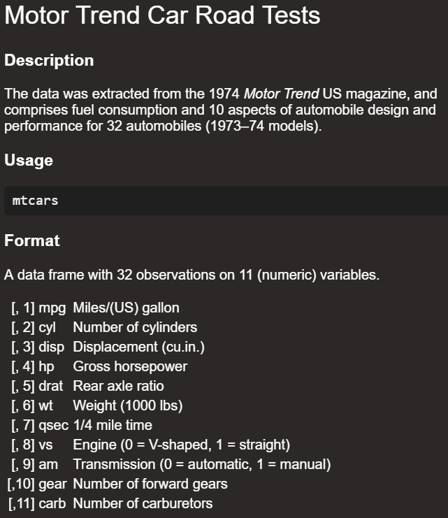

```{r setup, include=TRUE}

# this line specifies options for default options for all R Chunks
knitr::opts_chunk$set(echo=T, 
                      highlight=T)

# suppress scientific notation
options(scipen=100)

# install helper package (pacman) if needed
if (!require("pacman")) install.packages("pacman", repos = "http://lib.stat.cmu.edu/R/CRAN/")

# install and load required packages
# pacman should be first package in parentheses and then list others
pacman::p_load(pacman, tidyverse, gridExtra, knitr, magrittr)

# verify packages (comment out in finished documents)
p_loaded()

```

---

### Reminders:

#### HW 3 Due 2/7

**There is a 2 day grace period on this assignment.**

- Practice Questions from Spring of 2023 are Posted.

- I will talk more about the test on Thursday

- On Tuesday, I will hold an optional Q&A Zoom at 7:00 PM

  - Come with questions because I will not prepare material.


### Quiz 1 on Thursday 2/15

- Weeks 1 - 4 (Lectures 1 - 8)
  
- HW 1 - 3

---

### Side Trip about piping

###   **`%>%`**     vs.     **`|>`**

- What's the difference?

- For your purposes they are interchangeable, but |> is newer 

- `%>%` requires `magrittr` package but `|>` doesn't 

   - I load it anyways as a precaution in case I need other pipe functions
   
- `|>` may give you an error if are working on a machine with an old version of R or RStudio

- `|>` is slightly more efficient because of what the computer is doing is slightly different

- [More information for those who are interested (not required)](https://www.r-bloggers.com/2021/05/the-new-r-pipe/)


---

### Reminder of In-class Exercise from Week 3

```{r import and prep bom2022}

mojo_22_fall_wknd <- read_csv("Box_Office_Mojo_Week3_HW3.csv", show_col_types=F) |>   # import data
  mutate(Month = factor(month,                                                        # create factors
                         levels=c("Jan", "Feb", "Mar", "Apr", "May", "Jun",
                                  "Jul", "Aug", "Sep", "Oct", "Nov", "Dec")),
         Day = factor(day,     
                         levels=c("Mon", "Tue", "Wed", "Thu", "Fri", "Sat", "Sun"),
                         labels= c("M", "T", "W", "Th", "F", "Sa", "Su"))) |>
  select(Month, Day, top10gross) |>                                                  # select variables
  group_by(Month, Day) |>                                                            # group by category
  summarize(max_top10g = max(top10gross, na.rm=T)) |>                                # summarize
  ungroup() |>                                                                       # ungroup
  filter(Day %in% c("F", "Sa", "Su") & Month %in% c("Sep", "Oct", "Nov", "Dec"))     # filter fall wknds


```

---

### Completed code from Week 3 Exercise

Alternative to option below:

- Round data as desired in mutate statement before reshaping data with `pivot_wider`.

```{r  completed code from Week 3}


mojo_22_fall_wknd_wide <- mojo_22_fall_wknd |>
  mutate(max_top10g = (max_top10g/1000000) |> round(4)) |>                # convert to millions
  pivot_wider(id_cols=Month, names_from = Day, values_from = max_top10g)  # reshape data

mojo_22_fall_wknd_wide[,2:4] <- round(mojo_22_fall_wknd_wide[,2:4],1)     # round cols 2-4 to one decimal

# mojo_22_fall_wknd_wide[,2:4] <- round(mojo_22_fall_wknd_wide[,2:4])     # round cols 2-4 to whole numbers

mojo_22_fall_wknd_wide |> write_csv("Week_4_In_Class_First_Name_Last_Name.csv") # export as .csv 

mojo_22_fall_wknd_wide |> kable()       # create kable table (was not required in Week 3)


```

---


### Week 4 In-class Exercises (L7 - Q2)

***NOT ON PointSolutions***

If all the columns in a dataset are numeric, you can round the whole dataset at once with the command `round(<name of dataset>)`.

Why wouldn't that work for the dataset in the previous exercise, `mojo_22_fall_wknd_wide`?

<br>

Hint: To answer this question, you are encouraged to 

- try running the command `round(mojo_22_fall_wknd_wide)` 

- examine the data using `glimpse` 

---

## Review of Skills Learned

### Week 1

- R and R Studio 

- R Projects and R Markdown files

- Selecting data rows and columns by location using square brackets

- Examining data using `summary` and `unique`, and `table`

- Data types:

  - numeric (*`<dbl>`*, *`<int>`*)
  
  - character (*`<chr>`*)
  
  - logical (*`lgl`*)
  
  - factor(*`<fct>`*, *`<ord>`*)
     - Recall that in Week 3 we discussed how to convert character variables to factors
     
     - Numeric variables can also be converted to factors
     
---
  
### Week 2

- Review of Week 1 

- `dplyr` package commands to select, modify, and summarize data:
  
  - `select` - used to select variables
  
  - `filter` - used to filter observation by observation values
  
     - Can be used with 
        
       - numeric values
       
       - character values
       
       - factor levels
  
  - `slice`  - used to filter or select observations by location
  
  - `mutate` - used to modify variables or create new variables
  
  - `factor` - used to create a factor variable from another variable
  
---

### Week 3

- Review of Weeks 1 and 2 
  
- Coercion commands to coerce a variable to the type needed
    - `as.integer`, `as.numeric`, `as.character`
    
       - HW 3 included `as.integer`
       
       - Week 3 included a preview demo of `as.numeric`
       

- `dplyr` commands 

   - `group_by` and `filter`
   - `group_by` and `summarize`
  
- Commands to reshape data:
    - `pivot_wider`and  `pivot_longer`
  
- Display data table using `kable()`

- Creating a basic unformatted plot using **`ggplot`
  
  - boxplot: `geom_boxplot`
  - barplot: `geom_bar`
  - scatterplot: `geom_point`
  - line plot: `geom_line`
  - area plot: `geom_area`
  
---

### Format of Quiz 1

- **Students will have 70 minutes**

- **Students with an accommodation: we will schedule an alternative.**

   - Tentative Time: Friday 2/16 at 2:00 PM

<br>

- **All students must work alone.**

- **Quiz intended to be long and many students may not finish.**
  
  - All questions are equally weighted and independent.
  - Do the best you can.
  - There will be approximately 7-9 multi-part questions on Blackboard.
  - Each question will have multiple versions.
  - The questions will include instructions and may include some partial R code.
  
<br>  
  
- **For each question you will:**
 
  - Copy and paste provided R code into provided Quiz 1 template in provided Quiz 1 R project.
  - Complete the R code in the Quiz 1 template and save your work.
  - Answer the question on Blackboard.
  
  
---

### Grading of Quiz 1 

- Grading will take a little time. In addition to your Blackboard answers you are required to submit

  - **your R Markdown (.Rmd) file**
  - **YOU DO NOT HAVE TO SUBMIT A ZIPPED PROJECT.**
  
- I can not give you full credit if you do not show your work in an R Markdown file.
  
- Reminder: You can use different code than what is taught and will receive full credit if the result is correct.


- For each question, the grade will be tallied as follows:
  - R code (.qmd and Rhistory file 10%) - quick check
  - Blackboard answers (90%) 

- Quiz 1 is worth 22.5% of your final grade in this course.


### Practice Questions for Quiz 1

- There are a set of 14 practice questions posted on Blackboard.

- Quiz 1 questions will be similar to these and will use these same datasets or similar ones.

- If other data are used:
  - I will post an announcement, so you can examine the data and documentation before the quiz.
  
---

### Before Thursday

- Download and save the Practice Questions

- Look over Blackboard Questions
  - Take notes on what is not clear for you.
  - I will answer questions on Thursday.

- I will post a video playlist of solutions for Practice Questions before the next lecture.

### Before Quiz 1:

- Work through all the practice questions and write the code with comments to make sure you understand it.

- Quiz 1 is open notes so you can use the code you create for the Practice Questions.
  
- Make sure that your laptop has up-to-date versions of R and RStudio
  
- All packages listed in the setup for Quiz 1 are successfully installed and loaded in R on your laptop.
  
---

### Examining Data and Data Help files

**Throughout the practice questions, you are asked to:**
- Examine data help files
- Examine data using `glimpse`
- Examine Data in the Global Environment
- Examine and and sort the data.

**Examining data help files**

Type `?mtcars` in the R Console (lower left pane) and click Enter.

Documentation about the dataset will appear in the lower right **Help** window.

Documentation describes variables by name and explains how the data are coded.




---

### Examining Data with `glimpse`

```{r mtcars}
my_mtcars <- mtcars |> glimpse() # save data to Global Environment and examine
# ?mtcars                        # request data help file
```

---

### Examining the Data 

Once the dataset is saved to the Global Environment you can click on it.

Click on dataset name in Global Environment.
- This will open the dataset in a tab in upper right pane.
- Click on tab to view data.
- Click on variables to sort them


#### Week 4 In-class Exercises (L7 - Q3-Q4)
***Point Solutions Session ID: bua455s24***

**`Q3.`** The `mtcars` dataset is saved as `my_mtcars` in the Global Environment.

This dataset has
`____` observations (rows).

<br>


**`Q4.`** Examine this new data set in the **Global Environment** to answer this question:

The car with the **LOWEST** fuel efficiency (`mpg`) is the
`_______`

---

### All Datasets in Quiz 1 Practice Questions

```{r save datasets to global environment}

# save R datasets for Quiz 1 to Global Environment
my_mtcars <- mtcars
my_diamonds <- diamonds
my_starwars <- starwars
my_orange <- Orange

# import these two summary datasets 
# mn_numreleases is the mean number of releases in movie_smry_w1
movie_smry_w1 <- read_csv("Movie_Summary_Wide_1.csv", 
                          show_col_types = F)
# mn_top10gross is the mean gross of the top 10 movies in movie_smry_w2
movie_smry_w2 <- read_csv("Movie_Summary_Wide_2.csv", 
                          show_col_types = F)

# mojo1999 is the full year of movie data from 1999
mojo1999 <- read_csv("Box_Office_Mojo_1999.csv", show_col_types = F)

```

---

### Overview Of Practice Questions

- 2 Questions about `mtcars` saved as `my_mtcars`

- 3 Questions about `diamonds` saved as `my_diamonds`

- 1 Question about `starwars` saved as `my_starwars`

- 1 Question about `Starwars_Summary.csv` imported as `starwars_smry`

This dataset are imported in Question 6 from the Practice Questions.

```{r starwars smry import q6}
starwars_smry <- read_csv("Starwars_Summary.csv", show_col_types = F)
```

- 3 Questions about `Orange` saved as `my_orange`

- 2 Questions about 2 imported Movie Summary Datasets

  - `Movie_Summary_Wide_1.csv` imported as `movie_smry_w1`
  - `Movie_Summary_Wide_2.csv` imported as `movie_smry_w2`
  
- 2 Questions about 1 imported full year of Movie data, imported as `mojo_1999`.
  
<br>
  
***Questions are designed to be short, but Quiz questions will be a little shorter.***

---

### Practice Question 1 (abridged)

Examine the my_mtcars dataset using **`glimpse`**.

**`1.`** How many rows are in the original my_mtcars dataset?


**`2.`** `mtcars` is an older dataset so although there are many kinds of variables they are all coded as one type of variable for simplicity.

All of the variables in the **`my_mtcars`** dataset are type `____`?
 
Save a new version of `my_mtcars` to a new name such as `my_mtcars1` and filter the new dataset to:

only include cars with BOTH a straight engine (variable is `vs`) and an automatic transmission (variable is `am`).

Examine the new filtered data set in the Global Environment or using `glimpse`.


**`3.`** How many rows are in this new filtered dataset you created?
 

Click on this new filtered dataset in the Global Environment to answer this question. Round your answer to a whole number.

**`4.`** Within the new filtered dataset, the highest mpg (miles per gallon) is `____`.

---

### Plan for Thursday

- I will post a video for each Practice Question

- You should 

  - Finish HW 3
  
  - Read through these questions.
  
    - Take notes of questions you don't understand
    
    - Clarifications requested will make Quiz 1 more clear.
    
    - Practice Questions have typos. 
      - **Please let me know.**
    
### Time for Questions

- Questions about Practice Questions and Quiz 1

- Individual Questions about HW 3


---

### Practice Question (Question 2)

- Use square brackets to select **rows 6 through 25** and **columns 1, 2, and 6** of the my_mtcars data set and save this smaller dataset as a new data set with a different name, e.g. **`my_mtcars2`**.


- Examine the new dataset using glimpse.

- The variables in your new dataset should be **`wt`**, **`mpg`**, and **`cyl`**. 

- You can examine the definitions of these variables by examining the dataset help file:

1. In the console, type ?mtcars
2. Examine the dataset documentation in the help window in the lower right panel of RStudio.

- Create and save a scatter plot with **`x = wt`**, **`y = mpg`**, and **`color = factor(cyl)`**.

**Note that color = factor(cyl) is used because cylinder is an ordinal categorical variable and we want the plot to show that.**

Click on the dataset in the Global Environment to answer questions 1 and 2

Hint: Once the dataset is opened, remember that you can click on a column to sort the dataset by a specific variable.


```{r Q2}
my_mtcars2 <- my_mtcars[6:25, c(1,2,6)] |>
  glimpse(width = 40)

(mtcars_scatter <- my_mtcars2 |>    
   ggplot() +
   geom_point(aes(x=wt, y=mpg, color=factor(cyl))))

```


---


***Point Solutions Session ID: bua455s24***
#### Week 4 In-class Exercises (L8 - Q1-Q3)

**`Q1`** How many categories are in the cyl (cylinder) variable in the dataset you created?

<br>

**`Q2`** The lowest mpg in your new dataset is

<br>

**`Q3`** Based on the plot, specify whether the correlation between each pair of variables is positive (1) or negative (2).

Enter the number of the correct choice.

- There is a `____` correlation between `wt` and `mpg`.

- There is a `____` correlation between `cyl` and `mpg`.

- There is a `____` correlation between `wt` and `cyl`.

---

### Key Points from Week 4

**Review of Weeks 1 - 3:**

- Use Practice Questions to Guide your Review

- ALSO review Lecture Notes and HW assignments

- Make sure you are comfortable with downloading, unzipping and saving R projects to your computer.

- Come with questions about any and all skills and concepts we have covered

- If there are few to no questions

  - I will use the Practice Questions to guide the lecture 
  - I will remind you of key details
  
- There will be polling questions

You may submit an 'Engagement Question' about each lecture until midnight on the day of the lecture. **A minimum of four submissions are required during the semester.**
