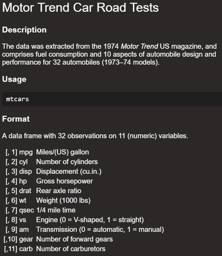

```{r setup, include=FALSE, echo=FALSE}
options(htmltools.dir.version = FALSE)
knitr::opts_chunk$set(
  fig.retina=2,
  #out.width = "75%",
  #out.height = "50%",
  htmltools.preserve.raw = FALSE,      # needed for windows
  scipen=100,                          # suppresses scientific notation
  getSymbols.warning4.0 = FALSE,       # suppresses getSymbols warnings
  cache = FALSE,
  echo = TRUE,
  hiline = TRUE,
  message = FALSE, 
  warning = FALSE
)


# install helper package (pacman)
# pacman loads and installs other packages, if needed
if (!require("pacman")) install.packages("pacman", repos = "http://lib.stat.cmu.edu/R/CRAN/")

# install and load required packages
# pacman should be first package in parentheses and then list others
pacman::p_load(pacman, tidyverse, magrittr, gridExtra, knitr)

# verify packages (comment out in finished documents)
p_loaded()


```

```{r xaringan-themer, include=FALSE, warning=FALSE}
library(xaringanthemer)

palette <- c(
  SU_Orange1        = "#F76900",
  SU_Orange2        = "#FF8E00",
  SU_Red_Orange     = "#FF431B",
  SU_Blue1          = "#000E54",
  SU_Blue2          = "#203299",
  SU_Light_Blue     = "#2B72D7",
  SU_White          = "#FFFFFF",
  SU_Light_Gray     = "#ADB3B8",
  SU_Medium_Gray    = "#707780",
  SU_Black          = "#000000", 
  
  steel_blue        = "#4682B4",
  corn_flower_blue  = "#6495ED",
  deep_sky_blue     = "#00BFFF",
  dark_magenta      = "#8B008B",
  medium_orchid     = "#BA55D3",
  lime_green        = "#32CD32",
  light_sea_green   = "#20B2AA",
  chartreuse        = "#7FFF00",
  orange_red        = "#FF4500",
  white_smoke       = "#F5F5F5",
  dark_cyan         = "#008B8B",
  light_steel_blue  = "#B0C4DE",
  indigo            = "#4B0082",
  ivory             = "#FFFFF0",
  light_slate_grey  = "#778899",
  linen             = "#FAF0E6",
  steel_blue        = "#4682B4",
  blue_violet       = "#8A2BE2",
  dodger_blue       = "#1E90FF",
  light_blue        = "#ADD8E6",
  azure             = "#F0FFFF",
  lavender          = "#E6E6FA")

primary_color = "#4682B4"                # steel_blue
secondary_color = "#778899"              # light_slate_grey
white_color = "#FFFFF0"                  # ivory
black_color = "#000080"                  # navy

style_duo_accent(
  primary_color = primary_color,
  secondary_color = secondary_color,
  white_color = white_color,
  black_color = black_color,
  text_color = black_color,
  header_color = primary_color,
  background_color = white_color,
  code_inline_background_color = "#E6E6FA", # lavender
  link_color = "#1E90FF",                   # dodger_blue
  code_inline_color = "#4B0082",            # indigo
  text_bold_color = "#8B008B",              # dark_magenta
  header_font_google = google_font("Open Sans"),
  text_font_google = google_font("Open Sans"),
  code_font_google = google_font("Source Code Pro"),
  colors = palette
)


```

```{r xaringan-panelset, echo=FALSE}
xaringanExtra::use_panelset()
```

```{r xaringan-tile-view, echo=FALSE}
xaringanExtra::use_tile_view()
```

```{r xaringan-fit-screen, echo=FALSE}
xaringanExtra::use_fit_screen()
```

```{r xaringan-tachyons, echo=FALSE}
xaringanExtra::use_tachyons()
```

```{r xaringan-animate-css, echo=FALSE}
xaringanExtra::use_animate_css()
```

```{r xaringan-animate-all, echo=FALSE}
#xaringanExtra::use_animate_all("slide_up")
```

background-image: url("docs_files/images/sloth_faded.png")
background-size: cover

class: bottom, right

## BUA 455 - Week 4

### Combining Skills and Quiz Review

<br>


#### Penelope Pooler Eisenbies

#### "September 20th and 22nd, 2022"

[Wikipedia Sloth Page](https://en.wikipedia.org/wiki/Sloth)

---

### Reminders:

#### HW 3 Due 9/21

**There is a 2 day grace period on this assignment.**

#### Textbook

- A list of text sections can be found **[here](https://docs.Google.com/spreadsheets/d/1yhUSJAJQ4VVjVBpiv3_C2D3tQs2SmJjynSq9chqXOwc/edit?usp=sharing)** and will be updated as the course progresses.

### Quiz 1 on Tuesday 9/27

- Weeks 1 - 4 (Lectures 1 - 8)
  
  - There will be a little new material this week, but we will mostly be discussing
  
     - a review of the skills covered so far
  
     - different ways to combine these skills
     
     - how to know what to do for a given data management situation
     
- HW 1 - 3

---

### Detour and Preview

.pull-left[

**How to talk about your skillset**

At the end of this course, I cover some related topics.

One key topic for students: 
- How do we explain our skills?

It can be more difficult than you expect.

<br>

**Good News:**

'Data Camp' has published a [White Paper about Data Fluency](https://drive.google.com/file/d/1_VoM3D6tPftjZpXCnTL8SKYBlOM_4KjG/view?usp=sharing).

It includes a great summary of skills and how they translate into roles in a working environment.

You do not have to read all 17 pages and you **DEFINITELY** will not be tested on this.

]

.pull-right[


]


---

### HW 3

.pull-left[

- - Before we discuss review for Quiz 1, we will complete HW 3 together.

- I will ask if there are questions about the first few parts

- Then we will work through Parts 3, 4, and 5

]

.pull-right[


]

---

### Week 1

- R and R Studio 

- R Projects and R Markdown files

- Selecting data rows and columns by location using square brackets

- Examining data using `summary` and `unique`, and `table`

- Data types:

  - numeric (*`<dbl>`*, *`<int>`*)
  
  - character (*`<chr>`*)
  
  - logical (*`lgl`*)
  
  - factor(*`<fct>`*, *`<ord>`*)
     - Recall that in Week 3 we discussed how to convert character variables to factors
     
     - Numeric variables can also be converted to factors
     
---
  
### Week 2

- Review of Week 1 

- `dplyr` package commands to select, modify, and summarize data:
  
  - `select` - used to select variables
  
  - `filter` - used to filter observation by observation values
  
     - Can be used with 
        
       - numeric values
       
       - character values
       
       - factor levels
  
  - `slice`  - used to filter or select observations by location
  
  - `mutate` - used to modify variables or create new variables
  
  - `factor` - used to create a factor variable from another variable
  
---

### Week 3

- Review of Weeks 1 and 2 
  
- Coercion commands to coerce a variable to the type needed
    - `as.integer`, `as.numeric`, `as.character`
    
       - HW 3 included `as.integer`
       
       - Week 3 included a preview demo of `as.numeric`
       

- `dplyer` commands `group_by` and `summarize`
  
- Commands to reshape data:
    - `pivot_wider`and  `pivot_longer`
  
- Display data table using `kable()`

- Creating a basic unformatted plot using **`ggplot`
  
  - boxplot: `geom_boxplot`
  - barplot: `geom_bar`
  - scatterplot: `geom_point`
  - line plot: `geom_line`
  - area plot: `geom_area`
  
---

### Format of Quiz 1

- Students will have 70 minutes

- Students with an accomdation we will schedule an alternative.

- All students must work alone.

- Quiz intended to be long and many students may not finish.
  
  - All questions are equally weighted and independent.
  
  - Do the best you can.
  
- There will be approximately 6-7 multipart questions on Blackboard.

  - Each question will have multiple versions.
  
  - The questions will include instructions and may include some partial R code
  
  - For each question you will:
  
        - copy and paste provided R code into provided Quiz 1 template in provided Quiz 1 R project
        - Complete the R code in the Quiz 1 template
        - Answer the question on Blackboard
  
---

### Grading of Quiz 1 

- Because there are 60 students, grading will take a little time.

- TAs and I will complete grading together.

- For each question, R code (60%) and Blackboard answers (40%) will count towards final grade.

- Quiz 1 is worth 22.5% of your final grade in this course.


### Practice Questions for Quiz 1

- There are a set of 11 practice questions posted on Blackboard.

- Your Quiz 1 questions will be similar to these and will use these same datasets or similar ones.

- If other data are used:
  - I will post an announcement, so you can examine the data and documentation before the quiz.
  
---

### Before Thursday

- Download and save the Practice Questions

- Look over Blackboard Questions
  - Take notes on what is not clear for you.
  - I will answer questions on Thursday.

- I will post video solution for Practice Questions on Thursday

### Before Quiz 1:

- Work through all the practice questions and write the code with comments to make sure you understand it.

- Quiz 1 is open notes so you can use the code you create for the Practice Questions.
  
- Make sure that your laptop has up-to-date versions of R and RStudio
  
- All packages listed in the setup for Quiz 1 are successfully installed and loaded in R on your laptop.
  
---

### Examining Data and Data Help files
.pull-left[

**Throughout the practice questions, you are asked to:**
- Examine data help files
- Examine data using `glimpse`
- Examine Data in the Global Environment
- Examine and and sort the data.

**Examining data help files**

Type `?mtcars` in the R Console (lower left pane) and click Enter.

Documentation about the dataset will appear in the lower right **Help** window.

Documentation describes variables by name and explains how the data are coded.

]

.pull-right[



]
   
---

### Examining Data with `glimpse`

```{r mtcars}
my_mtcars <- mtcars |> glimpse() # save data to Global Environment and examine
# ?mtcars                        # request data help file
```

---

### Examining the Data 

Once the dataset is saved to the Global Environment you can click on it.

Click on dataset name in Global Environment.
- This will open the dataset in a tab in upper right pane.
- Click on tab to view data.
- Click on variables to sort them


#### Week 4 In-class Exercises (L7 - Q1-Q2)
***Point Solutions Session ID: bua455s22***

**`Q1.`** The `mtcars` dataset is saved as `my_mtcars` in the Global Environment.

This dataset has
`____` observations (rows).

<br>


**`Q2.`** Examine this new data set in the **Global Environment** to answer this question:

The car with the **LOWEST** fuel efficiency (`mpg`) is the
`_______`

---

### All Datasets in Quiz 1 Practice Questions

```{r save datasets to global environment}

# save R datasets for Quiz 1 to Global Environment
my_mtcars <- mtcars
my_diamonds <- diamonds
my_starwars <- starwars
my_orange <- Orange |> glimpse()

# import these two summary datasets 
# mn_numreleases is the mean number of releases in movie_smry_w1
movie_smry_w1 <- read_csv("Movie_Summary_Wide_1.csv", 
                          show_col_types = F)
# mn_top10gross is the mean gross of the top 10 movies in movie_smry_w2
movie_smry_w2 <- read_csv("Movie_Summary_Wide_2.csv", 
                          show_col_types = F)

```

---

### Overview Of Practice Questions

- 2 Questions about `mtcars` saved as `my_mtcars`

- 2 Questions about `diamonds` saved as `my_diamonds`

- 1 Question about `starwars` saved as `my_starwars`

- 1 Question about `Starwars_Summary.csv` imported as `starwars_smry`

This dataset are imported in Question 6 from the Practice Questions.

```{r starwars smry import q6}
starwars_smry <- read_csv("Starwars_Summary.csv", show_col_types = F)
```

- 3 Questions about `Orange` saved as `my_orange`

- 2 Questions about 2 imported Movie Summary Datasets

  - `Movie_Summary_Wide_1.csv` imported as `movie_smry_w1`
  - `Movie_Summary_Wide_2.csv` imported as `movie_smry_w2`
  
<br>
  
***Questions are designed to be short, but Quiz questions will be a little shorter.***

---

### Example Practice Question (Question 2)

.panelset[

.panel[.panel-name[**Instructions**]

- Use square brackets to select **rows 6 through 25** and **columns 1, 2, and 6** of the my_mtcars data set and save this smaller dataset as a new data set with a different name, e.g. **`my_mtcars2`**.


- Examine the new dataset using glimpse.

- Create a factor variable, cylF, in this dataset. No levels or labels are needed.

- The variables in your new dataset should be **`wt`**, **`mpg`**, **`cyl`**, and **`cylF`**

- You can examine the definitions of these variables by examining the dataset help file:

1. In the console, type ?mtcars
2. Examine the dataset documentation in the help window in the lower right panel of RStudio.

- Create and save a scatter plot with **`x = wt`**, **`y = mpg`**, and **`color = cylF`**.

**Explore: How would plot look if cyl was used instead of cylF**

Click on the dataset in the Global Environment to answer questions 1 and 2

Hint: Once the dataset is opened, remember that you can click on a column to sort the dataset by a specific variable.

]

.panel[.panel-name[**R Code**]

.pull-left[

```{r Q2 part 1}
my_mtcars2 <- my_mtcars[6:25, c(1,2,6)] |>
  glimpse(width = 40)

my_mtcars2 <- my_mtcars2 |>
  mutate(cylF=factor(cyl)) |> 
  glimpse(width=40)

```

]

.pull-right[
- Plot is saved as `mtcars_scatter`
- Code is enclosed in parentheses so plot appears on screen
- **TO EXPORT PLOT:** Right click on it > Save As > ... 
```{r Q2 part 2, fig.dim=c(5,3)}
(mtcars_scatter <- my_mtcars2 |>    
   ggplot() +
   geom_point(aes(x=wt, y=mpg, color=cylF)))

```

]

]

.panel[.panel-name[**Questions**]

***Point Solutions Session ID: bua455s22***
#### Week 4 In-class Exercises (L7 - Q3-Q5)

**`Q3`** How many categories are in the cyl (cylinder) variable in the dataset you created?

<br>

**`Q4`** The lowest mpg in your new dataset is

<br>

**`Q5`** Based on the plot, specify whether the correlation between each pair of variables is positive (1) or negative (2).

Enter the number of the correct choice.

- There is a `____` correlation between `wt` and `mpg`.

- There is a `____` correlation between `cyl` and `mpg`.

- There is a `____` correlation between `wt` and `cyl`.

]

]

---

### Plan for Thursday

.pull-left[

- I plan to make videos for each question

- You should 

  - Finish HW 3
  
  - Read through these questions.
  
    - Take notes of questions you don't understand
    
    - Clarifications requested will make Quiz 1 more clear.
    
    - Practice Questions have typos. 
      - **Please let me know.**
    
### Time for Questions

- Questions about Practice Questions and Quiz 1

- Individual Questions about HW 3

]

.pull-right[


]


---

background-image: url("docs_files/images/tired_panda_faded.png")
background-size: cover

.pull-left[

### **Key Points from Week 4**

.bg-azure.b--dark_cyan.ba.bw2.br3.shadow-5.ph2[

**Review of Weeks 1 - 3:**

- Use Practice Questions to Guide your Review

- ALSO review Lecture Notes and HW assignments

- Make sure you are comfortable with downloading, unzipping and saving R projects to your computer.

- Come with questions about any and all skills and concepts we have covered

- If there are few to no questions

  - I will use the Practice Questions to guide the lecture 
  - I will remind you of key details
  
- There will be polling questions

]

]

.pull-right[


.bg-azure.b--dark_cyan.ba.bw2.br3.shadow-5.ph3[
**You may submit an 'Engagement Question or Comment' about Week 4 lectures until Thursday, 9/22, at midnight on Blackboard.**
]


]

    


